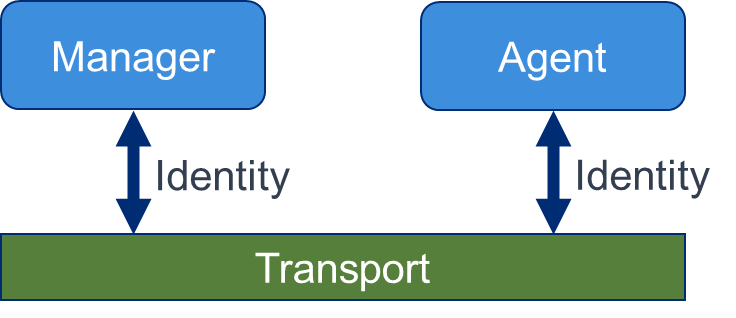
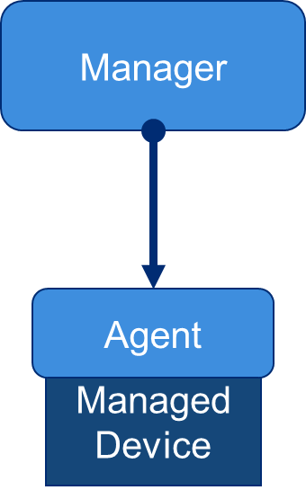
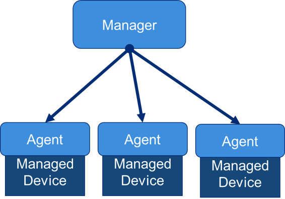
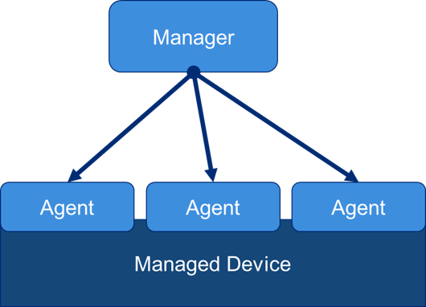
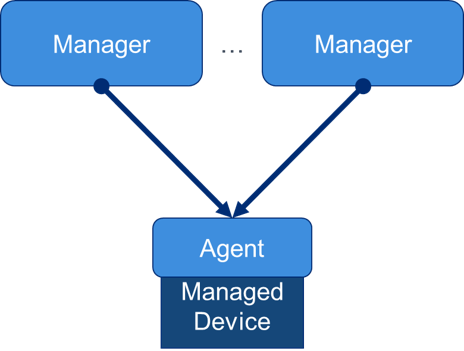
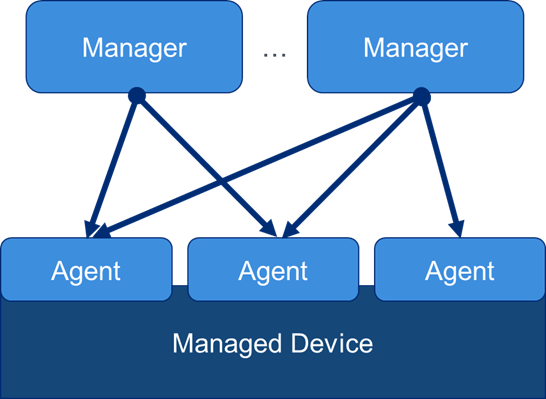
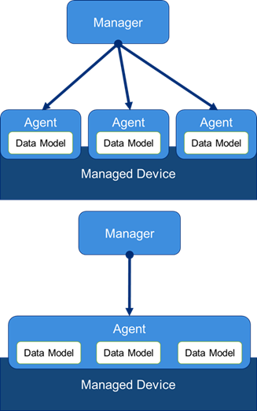
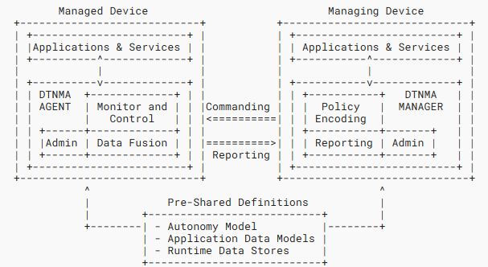
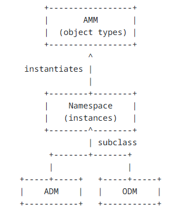

<!--
Copyright (c) 2024-2026 The Johns Hopkins University Applied Physics
Laboratory LLC.

This file is part of the Delay-Tolerant Networking Management
Architecture (DTNMA) documentation project.

Licensed under the Apache License, Version 2.0 (the "License");
you may not use this file except in compliance with the License.
You may obtain a copy of the License at
    http://www.apache.org/licenses/LICENSE-2.0
Unless required by applicable law or agreed to in writing, software
distributed under the License is distributed on an "AS IS" BASIS,
WITHOUT WARRANTIES OR CONDITIONS OF ANY KIND, either express or implied.
See the License for the specific language governing permissions and
limitations under the License.
-->
# Introduction to Delay-Tolerant Networking Management Architecture

This document introduces the Delay/Disruption-Tolerant Networking Management Architecture (DTNMA) \[[RFC9675]], a framework for managing devices and exchanging management information in environments with long signal propagation delays and frequent link disruptions (i.e., Delay/Disruption-Tolerant Networks (DTNs)). The following content offers an overview of the key DTNMA concepts. A complete description, along with examples, can be found in the official DTNMA reference \[[RFC9675]].

* TOC
{:toc}

## How Does Remote Management Work

Remote management allows the oversight, configuration, and control of systems and devices from a location separate from the managed resource. It is implemented via a dedicated management plane and specialized software, with security provided by both the management layer (e.g., identity, authorization, access control) and the underlying transport (e.g, encrypted communications and integrity).

Remote management works by installing lightweight agents on managed devices that send current data, upon request, to a remote manager entity. Remote management involves the following three main components:

- *Manager System*: The manager application that sends configuration requests and control commands to remote devices, and receives and processes monitoring data, often in real time.
- *Remote Agent*: A software component running on the managed, remote device, responsible for handling requests from the manager and returning relevant data such as health metrics, performance statistics, and logs.
- *Management Transport*: The end-to-end connectivity path and protocol stack (physical, link, network, and transport layers) between the manager and the remote agent that carries management traffic. The transport may be persistent/interactive or opportunistic/scheduled (store-and-forward), depending on connectivity and operational requirements.

## Existing Remote Management Solutions

Many remote management solutions have been developed for both local-area and wide-area networks. Their capabilities range from simple configuration and report generation to complex modeling of device settings, state, and behavior. Each of these approaches are successful in the domains for which they have been built, but are not all equally functional when deployed in a challenged network.

- *Simple Network Management Protocol (SNMP) Model*: A request/response model used to get and set data values within an arbitrarily deep object hierarchy. Objects in SNMP \[[RFC1157]] are used to identify data such as host identifiers, link utilization metrics, error rates, and counters between application software on managing and managed devices. The SNMP protocol itself, which is at version 3 \[[RFC2570]], can operate over a variety of transports \[[RFC3417]], including plaintext UDP/IP, SSH/TCP/IP \[[RFC5592]], and DTLS/UDP/IP or TLS/TCP/IP. The SNMP model is mainly used for monitoring and managing network devices within enterprise networks, data centers, the Internet of Things, and Industrial systems.
- *XML-Infoset-Based Protocols*: Several network management protocols, including NETCONF \[[RFC6241]], RESTCONF \[[RFC8040]], and CORECONF \[[CORECONF]], share the same XML information set \[[XML-INFOSET]] as their foundation for for structuring and exchanging data between systems and XPath expressions \[[XPath]] to identify nodes of that information model. XML-based protocols are mainly used in enterprise web services, instant messaging applications, and message-oriented middlewares.
- *gRPC Network Management Interface (gNMI)*: It is based on gRPC messaging and uses Protobuf data modeling \[[GNMI]]. This model shares the same limitations of some of the XML-based models listed above- it relies on synchronous HTTP exchanges and TLS security for normal operations, as well as uses deeply nesting data schemas.
- *Intelligent Platform Management Interface (IPMI)*: A lower-level remote management protocol, intended to be used to manage hardware devices and network appliances below the operating system (OS) \[[IPMI]].
- *Autonomic Networking*: A new paradigm of remote network management that focuses on autonomous behaviors including self-configuration, self-management, self-healing, and self-optimization \[[RFC7575]].

### Remote Management Models in Challenged Environments

Existing remote-management architectures (e.g., SNMP, NETCONF/RESTCONF) are typically optimized for infrastructure-rich, low-latency enterprise and cloud networks. They assume reliable end-to-end transport (e.g., TCP), manager-initiated, synchronous exchanges, continuous reachability, and minimal autonomy at the edge. These choices centralize complexity and use bandwidth efficiently when communication links are stable.

In intermittently connected, high-latency, or disrupted environments (e.g., space, tactical, disaster recovery), the usual assumptions break down: communication sessions drop, round trips dominate, and manager-driven control stalls when connectivity does. The result is delayed visibility and management response—not because these existing architectures are deficient, but because their design assumptions don’t hold in this context. This motivates a remote management model that treats connectivity as opportunistic, favors asynchronous and resumable exchanges, elevates policy-driven autonomy at the edge, and degrades gracefully under disruption. The next section outlines such a design.

## Why Do We Need a New "Management Architecture"?

Outer-space communications and  management, as envisioned in NASA's Solar System Internet initiative \[[NASA-SOLAR]], are expected to occur over Delay/Disruption Tolerant Networking (DTN). DTN environments introduce several communication challenges for existing remote management solutions, primarily due to the possibility that a communication channel between a manager system and a remote agent may be: (1) absent, (2) disconnected, (3) delayed, or (4) subject to significant rate mismatches.

To address these challenges, the DTN Management Architecture (DTNMA) require three key design requirements:

- *Asynchronous*: Due to intermittent connectivity and the frequent absence of end-to-end communication paths in DTNs, these networks often experience long and unpredictable delays. As a result, management messages may be delayed or arrive out of order. To cope with these challenges, management operations must be designed to function asynchronously, tolerating significant communication delays and disruptions.
- *Locally Autonomous*: Another consequence of intermittent communications in DTNs is that management messages may never arrive, making it impossible at times for devices to communicate with their manager. In such cases, devices must make decisions and take actions independently, relying on local management policies or pre-loaded rules.
- *Lightweight*: Nodes in DTN networks (e.g., satellites and small spacecraft) are often limited in CPU capabilities, memory, and power. Therefore, management solutions must minimize resource consumption. To be practical for deployment in these constrained environments, DTNMA must be lightweight, both in terms of computational overhead and message size.

DTNMA fulfills these requirements by avoiding assumptions of synchronized transport or continuous query–response patterns, enabling robust operation even over unidirectional or severely challenged links. DTNMA, and most DTN applications, are typically built atop the Bundle Protocol (BP), which is specifically designed to provide relatively reliable, link-independent communication in environments with intermittent connectivity and high delays.

The use of BP strengthens DTNMA’s effectiveness in several ways: it implements a store-and-forward framework, allowing data to be “stored and waited” until communication is possible; it supports asynchronous operations; and it facilitates local autonomy through custody transfer and persistent storage of management directives. BP also minimizes protocol overhead, making it suitable for resource-constrained nodes, and leverages embedded metadata and delivery controls to help ensure end-to-end data delivery across diverse network links. In essence, BP offers a general-purpose network and transport layer—similar to TCP/IP for the terrestrial Internet—but engineered for the extreme conditions of space and other challenged environments.

DTNMA adopts BP’s store-and-forward, asynchronous approach for management tasks. This allows agents to execute policies autonomously without constant contact, tolerate long delays, and ensure that management directives persist through disruptions. By using efficient representations such as the Application Management Model (AMM), DTNMA further reduces overhead while maintaining interoperability and extensibility. These design choices make DTNMA especially suited for resilient, autonomous, and effective management in environments where traditional methods fall short.

## Relevant Terminology

Glossary of terms used in DTNMA:

| Term | Comments |
| :---  | --- |
| **Managed Device** | The physical or logical entity being remotely managed. |
| **Managing Device** | The physical or logical entity that performs remote management through DTNMA (e.g., Network Supervisor). |
| **Agent** | The software component that enables access to the Managed Device by a Managing Device. |
| **Manager** | The software component that communicates with the Agent in order to control the Managed Device. |
| **Autonomy** | The capability of an Agent to apply control and management rules on itself in case of disrupted communications, based on a set of Autonomy Rules previously provided by a Manager. |
| **Autonomy Rules** | The set of policies, typically in "if‑then" form, that an Agent uses to autonomously manage itself when disconnected or when standard remote control from the Manager is not feasible. |
| **Object Model** | Specifies the object types (such as data types) that a Manager can use to control a remote Agent. |
| **Data Model** | A data model outlines the structure and format of the controls and reports exchanged between a Manager and an Agent to facilitate effective management. |
| **Application Management Model (AMM)** | The formal, structured representation of a Data Model that is specific to DTNMA. It organizes the controls, parameters, and reports needed for managing applications on remote Agents using DTNMA. |
| **Application Data Model (ADM)** | The static set of AMM objects that represent the formal specification of all the management information for a given Agent in DTNMA. It defines what can be monitored and controlled, in a way that is unambiguous and machine-readable. |
| **Operational Data Model (ODM)** | The set of dynamically-defined AMM objects created and controlled by a Manager. |
| **Object** | A member of a specific data model with a unique identity. |
| **Value** | The piece of data associated to a specific object and that is exchanged between between a DTNMA Manager and an Agent. |
| **DTNMA Asynchronous Management Protocol ([AMP])** | The messaging protocol for the DTNMA. |

## Design Characteristics in DTNMA

This section lists design characteristics of DTNMA:

- *Agent-Manager Exchange*: Information exchange between a DTNMA Manager and Agent should be lightweight, efficient, resilient, and simple, with a predictable serialization. **DTNMA uses AMP messages as the on-the-wire protocol data unit, independent of the underlying transport**. Within an AMP message, the management payload is structured as an Application Resource Identifier (ARI). This document covers ARIs in more detail in a [later section](#dtnma-application-resource-identifier-ari). Common ARI collections include Execution Sets (EXECSETs) from Manager to Agent and Reporting Sets (RPTSETs) from Agent to Manager. An EXECSET contains one or more execution targets, such as *controls* or *macros* to be executed by the Agent. An RPTSET contains one or more report entries returned to the Manager. Multiple ARIs may be combined within a single AMP message as needed.
  - *Control EXECSET*: Controls may be executed by the Agent in no guaranteed order. To enable tracking/correlation, a control EXECSET may include an optional correlator nonce. Reports generated by those controls include the nonce so the Manager can associate them with the originating EXECSET—and, when applicable, with specific targets.
  - *Macro EXECSET*: A macro is an ordered sequence of steps that must execute sequentially. Because ordering provides implicit correlation, a correlator nonce is generally unnecessary.
- *Transport-agnostic Solution*: Communication between the DTNMA Agent and Manager relies on an underlying transport, but DTNMA is transport-agnostic, meaning it can operate over any suitable transport. In DTN environments, management exchanges cannot assume persistent sessions, synchronized round trips, reliable connectivity, or in-order delivery. By not depending on transport specifics, DTNMA remains flexible and robust over unidirectional, high-delay, or intermittent links, ensuring interoperability and adaptability in the variable conditions typical of DTNs. However, transport-agnosticism shifts certain guarantees to the management layer. When the transport does not provide reliability or ordering, the Manager and Agent must handle out-of-order processing, deduplication, retransmission policy, and correlation of results with their originating commands.
- *Identity Requirements*: Despite potential unreliability in the transport layer, DTNMA requires that all delivered data is associated with a clear source identity and that every message is sent to a defined destination identity. These identities must also be transport-independent; meaning each transport biding must specify how entities are represented and authenticated. Some cases below:
  - *BPv7 Binding*: When Bundle Protocol v7 \[[RFC9171]] is used to support communications within DTNMA, message sources and destinations (also called endpoints) are identified using Endpoint IDs (EIDs), such as dtn://node/adm or ipn:19.6. In DTN/BPv7, an Endpoint ID (EID) is written like a web-style identifier called URI \[[RFC3986]]. Two common DTN schemes are `dtn:` and `ipn:`. The `ipn` scheme is more commonly used in DTNMA and combines numeric node and service numbers following the format `ipn:<node>.<service>`. In this case, `<node>` is a numeric node ID and `<service>` is a numeric service ID.
  - *TCP Binding*: The strategy for network addressing is `IP:port`, but identity and authentication may be provided by a secure transport such as mutual Transport Layer Security (TLS).
  - *Unauthenticated Transport*: Each AMP message must carry a verifiable identity claim (e.g., signature/MAC) so the receiver can cryptographically bind messages to a sender, independent of source address.
- *Unique Peer Identity, Many Possible Identifiers*: DTNMA doesn’t mandate a single identifier scheme (e.g., `dtn:` or `ipn:`), only that each management peer has a unique, trustworthy, authenticated identity. Each transport binding specifies how that identity is represented and proven. As noted above, for BPv7, these identities are EIDs. For TCP, the peer identity is represented using the `IP:port` addressing format. For local bindings (e.g., a specific software component or device sub-system that will ultimately generate/consume the piece of data being sent/delivered), the identities could be Application Process Identifiers (APIDs) or any other software bus identifiers.
- *Mapping Identities to Lower Layer IDs*: At the DTN and management layers, endpoint identifiers (such as BPv7 EIDs or DTNMA identities) are not linked/fixed to specific network addresses. Instead, they can be “late bound” to the actual network addresses at the time of delivery. BPv7 explicitly supports this late binding, allowing overlay endpoint identifiers to be mapped to the relevant lower-layer (constituent-network) addresses only when needed. As a result, DTNMA identities remain flexible and can be cleanly mapped to whatever network technologies or addressing schemes are present at the lower layers.

  
   <em>Figure 1. DTNMA Manager and Agent exchange EXECSET and RPTSET messages through a common transport layer. Every delivered value SHALL be attributable to a unique, authenticated source endpoint identity and every sent value SHALL target a unique destination endpoint identity.</em>

## Expected Operating Environment for DTNMA

Many deployment scenarios are possible in DTNMA, as described below:

| **Deployment Diagram** | **Description/Comments** |
|:--:|--|
|  | **One Manager - One Agent:** A single Manager communicates with a single Agent. This setup is straightforward, simple, easy to configure, and introduces minimal overhead. However, it lacks scalability and resilience, since it cannot handle large networks and creates a single point of failure if the Manager goes down. One-to-one operates independently of and in parallel with any other remote management and control (M&C) activities. As pointed in a previous section, each (managed, managing) entity still needs a unique identity for transport binding and access control and the reachability between the two entities does not need to be continuous or symmetric. |
|  | **One Manager - Many Agents on Multiple Managed Devices:** A single Manager oversees multiple Agents running on different devices across a network. This model is common in typical monitoring and control (M&C) systems, as it centralizes operations and simplifies oversight. Its main advantages include easier correlation of data across devices and unified management from a single point. However, the Manager can become a bottleneck if too many Agents are monitored, and its failure would result in the loss of visibility and control over the entire infrastructure. In this deployment scenario, the Manager is also responsible for handling any necessary configuration tasks across Agents. One special case of the One manager -Multiple Agents case is the *failover manager*. This configuration increases availability by automatically switching to a backup system is the primary, designated manager fails. While such deployments are flexible in that the designated Manager can change over time, there will always be only one active Manager at any given moment. |
|  | **One Manager - Many Agents on a Single Managed Device:** A single Manager communicates with multiple Agents running on the same managed device, rather than across different devices (i.e., federated-Agent deployment). Each Agent is responsible for a specific, non-overlapping subsystem, function, or domain, such as hardware monitoring, configuration management, performance telemetry, or network controls. This modular approach allows new capabilities to be added without disrupting existing ones and provides a degree of fault isolation if one Agent fails. However, this model introduces additional overhead, since multiple Agents consume system resources, and there can be no rules that specifically coordinate operations between the Agents. It can also create management challenges if different Agents have authority over similar configuration parameters, increasing the risk of configuration inconsistencies. |
|  | **Many Managers One Agent:** In this scenario, multiple Managers connect to the same Agent and each Manager covers a separate and non-overlapping domain of responsibility. This allows Managers to specialize in different tasks/domains, such as performance monitoring, fault detection, or security auditing. The drawback is that the Agent must handle requests from several Managers, which increases its workload, and there is a risk of conflicting commands or configuration changes. The Agent uses the internal access control model (ACM) to distinguish how each Manager can interact with portions of the Agent’s data. |
|  | **Many Managers Many Agents:** This is a combination of the two previous scenarios. Is is possible for many different DTNMA Managers to have access and control many or all Agents running on the managed device. In this configurations, Agents should not expect to receive message for only one Agent. |
|  | **Federated Data Models:** Hosting multiple Agents on a single device can provide strong isolation and load-shaping across functions or domains, but that same isolation may limit interaction among their data models. In a single-Agent, multi-model design, a single Agent hosts several data models on the device—often in distinct namespaces—so it can enforce cross-model relationships, perform atomic transactions, and maintain consistent state across domains (e.g., interfaces, routing, QoS, and networking). This approach preserves logical separation through per-model access controls and scoping, while enabling richer inter-model validation and orchestration than a multi-Agent layout typically allows. The trade-offs are increased coupling and complexity within the Agent, potential resource contention, versioning and lifecycle management across models, and a single point of failure if the Agent is degraded or unavailable. |

## Message Transport in DTNMA

DTNMA does not define its own transport protocol requirements. It is transport-agnostic and operates over DTNs as well as IP-based networks. The underlying transport supplies naming, addressing, routing, and, where required, communications security. DTNMA does not prescribe how those communication and security services are services are provided.

A DTNMA message is an AMP message, which is basically the serialized on-the-wire protocol data unit (PDU) that carries one or more ARIs (e.g., EXECSET, RPTSET). ARIs encode management actions and reports, and multiple ARIs may be aggregated in a single AMP message.

The AMP specification defines an explicit BPv7 binding \[[AMP]]. AMP messages may also be carried over other transport bindings (e.g., ZeroMQ over TCP). In all bindings, delivery properties (reliability, ordering) and security services (authentication, integrity, confidentiality) are provided by the chosen transport/security layer; AMP does not implement these functions. DTNMA specifies the structure and semantics of management messaging (AMP + ARIs) and relies on the selected transport/binding for delivery and security properties.

## Security in DTNMA

Security in a DTNMA is achieved through three complementary mechanisms: 1) access control over data model components, 2) encoding of data model objects, and 3) secure messaging between Managers and Agents. While DTNMA defines how access control and encoding are applied, it delegates traditional security services (e.g., authentication, integrity, and confidentiality) to the underlying transport layer. Any chosen transport, such as the Bundle Protocol or other mechanisms, is therefore expected to provide these protections.

Access control ensures both the validity and restricted accessibility of data within the model. Some data may be visible to certain Agents or Managers while hidden from others. In DTNMA, access control is implemented through two complementary constructs:
- [Access Control Lists (ACLs)](#access-control-lists-acls), that define the rules governing permissions
- [Access Control Module (ACM)](#the-access-control-model-acm), that enforces those rules and isolates Manager interactions

Messaging and encoding security protect the exchange of information between Agents and Managers. DTNMA defines an encoding framework that ensures data is structured, unambiguous, and verifiable. When combined with secure transport, encoding allows encrypted data to be reliably reconstructed and validated, preventing replay attacks, misinterpretation, or parsing exploits. Thus, while encoding is a native function of DTNMA, the confidentiality and integrity of message exchanges depend on external secure transport mechanisms.

### The Access Control Model (ACM)

The ACM is typically part of a DTNMA Agent deployment and defines which portions of an Agent's data a Manager may access. This applies across all DTNMA operating environments, whether a single Manager interacts with one or multiple Agents, or multiple Managers access data from a single Agent. The ACM provides an additional layer of isolation when multiple Managers control the same Agent and constitute the mechanism used by the Agent to enforce rules, permissions, and access control policies. Each Manager is expected to have a unique identity, established through various transport bindings to the Agent. Based on this assumption, the ACM comprises three different pieces of information:

- A pattern for matching a Manager's identity
- A pattern for matching an Agent's identity, or perhaps an Agent's data model identity in cases of federated data models being used
- A specific set of permissions assigned to the associated Manager authorizing a level of access to the associated objects

### Access Control Lists (ACLs)

This control is achieved through Access Control Lists (ACLs), which define access permissions within DTNMA. In an ACL, permissions are represented by an Access Control Tag, where each tag is a bit mask corresponding to a set of flags (e.g., read, write, execute). Groups then establish mappings between an Access Control Tag and a collection of DTNMA objects for which permissions are applied. Access control is generally a function of DTNMA Agents, with ACL groups associated with specific Managers.

The set of permissions—represented by ACL tags and corresponding to a specific Access Control Model (ACM)—is defined by the mission operator or mission authority responsible for deploying and configuring the network and its management systems.

## DTNMA Normative References

The figure below summarizes the normative references in DTNMA.

  
   <em>Figure 2. A summary of the most relevant normative references in DTNMA.</em>

Normative references comprise many core technical documents that define the DTNMA architecture, its components, modeling, and messaging structures. A comprehensive list of these technical documents is summarized in the table below.

| DTNMA Component | Associated Standards | Description/Comments |
| ---  | :--- | --- |
| [DTNMA AMM] |  [RFC9675] (DTNMA) | Defines the Application Management Model (AMM) of DTNMA. |
| [ADM YANG] | [RFC7950] (YANG v1.1)</a> | Provides YANG encoding for DTNMA Application Data Models (ADM). |
| [AMP] | [RFC9171] (BPv7), [RFC9172] (BPSec) | Defines the Asynchronous Management Protocol (AMP) for carrying DTNMA.  |
| [DTNMA ARI] | [RFC3986] (URI)</a>, [RFC8949] (CBOR) | Defines the Application Resource Identifiers (ARIs) using URI and `CBOR` standards.  |

## How Does DTNMA work?

The DTNMA differs from other management architectures in three significant ways:

- **Pre-shared Definitions**: Managing and managed devices should operate using pre-shared data definitions and models. This implies that static definitions should be standardized whenever possible and that managing and managed devices may need to negotiate definitions during periods of connectivity.
- **Agent Self-Management**: Long periods of disconnection between managed and managing devices are typical and expected in DTNMA. In these cases, Agents must manage themselves by applying pre-shared policies received from managing devices.
- **DTN-Capable Command-Based Interface**: Like other management architectures, DTNMA exposes a command-oriented interface between the Manager and the Agent. Commands can create or update variables, modify data stores, or invoke controls that change device behavior. What differs is the execution model. Control operations in DTNMA are represented as ARIs and carried inside AMP messages; they execute opportunistically and asynchronously, without requiring a live session, and are tolerant of loss, duplication, and out-of-order delivery. When strict ordering is needed, macros provide an explicit sequential workflow, and reports are correlated back to the originating commands.

The DTNMA reference model is depicted below. This model closes the loop between services and applications running on both the managing and the managed devices and follows the well-established management approach of having Managers running on the managing device (e.g., network supervisor) and Agents running on the managed device. On the managing device (e.g., DTN network node) applications and services interact with a Manager entity, which relies on pre-shared definitions to generate policy directives. These directives are delivered to the managed device’s Agent via a command-based interface. The Agent monitors and controls the applications and services on the managed device, while also collecting and processing local data as needed to generate reports that are sent back to the Manager upon request.

  
   <em>Figure 3. The overall architecture of DTNMA.</em>

### The DTNMA Manager

The DTNMA Manager resides on the managing device. It provides an interface between various [managing applications](#managing-apps-and-services) and services and the Agents that enforce their policies. The DTNMA Manager performs three main functions:

- *Policy Encoding*: Managers translate policy directives from managing applications into standardized expressions that DTNMA Agents can interpret. They achieve this through three key functions: *Application Control Interfaces* to receive policy inputs from applications, *Policy Encoders* to convert these inputs into standardized autonomy model elements, and *Policy Aggregators* to package multiple encoded policies into network messages addressed to specific Agents.
- *Reporting*: Managers receive asynchronous reports from Agents during periods of connectivity, which may arrive out of order or be difficult to link directly to specific managing policies. To manage this, Managers employ three key components: *Report Collectors* to gather and extract report data, *Data Analyzers* to process the data through extraction, conversion, fusion, or analytics, and *Application Data Interfaces* to successfully deliver the processed results back to managing applications. Bookkeeping of incoming reports is handled by the Report Collector service. The Manager correlates each report to its ADM/ODM source and, when a correlator nonce was included in the EXECSET, use that nonce to associate results with the originating command \[[RFC9675]].
- *Administration*: Within DTNMA, Managers provide key administrative services to ensure effective and secure operations. They maintain *Agent Mappings* to identify the capabilities of individual Agents and ensure that only relevant controls are sent. They act as *Data Verifiers* by validating the syntax, semantics, and authorization of data received from Agents. Finally, they serve as *Access Controllers*, guaranteeing that controls are issued only when the Manager has appropriate access to both the Agent and its corresponding managed applications.

#### Managing Apps and Services

Managing applications and services reside on a managing device and serve as the both the source of Agent policy statements and the target of the Agent reporting.

### The DTNMA Agent

The DTNMA Agent resides on the managed device. It is responsible for the monitoring and control of the [managed applications](#managed-apps-and-services) and services. The DTNMA Agent accomplishes three major functions:

- *Monitoring and Control*: DTNMA Agents monitor and control applications on their managed devices using three core components. A *Rules Database* stores policy expressions (defined as stimulus–response pairs) that represent directives received from Managers and are evaluated by the autonomy engine. The *Autonomy Engine* enforces these rules by monitoring device state, issuing responses to defined stimuli, and executing additional actions configured by Managers, allowing autonomous operation even during disconnection. Finally, *Application Control Interfaces* enable the Agent to adjust the configuration and behavior of applications, either through custom interfaces or standardized frameworks provided by the operating system.
- *Data Fusion*: Agents produce new data elements based on the state of their managed devices and applications, which may be individual values or aggregated collections for reporting. They rely on three key components: *Application Data Interfaces* to retrieve state information from applications, *Data Value Generators* to derive new values from collected data, and *Report Generators* to assemble and deliver collections of data according to policy, critical events, or logging needs—independent of connectivity to a Manager.
- *Administration*: Agents provide key administrative services to support their configuration and secure operation. Through *Manager Mapping*, they manage many-to-many relationships with existing Managers, enabling multiple Managers to configure a single Agent or multiple Agent. As *Data Verifiers*, Agents validate the syntax, semantics, and authorization of externally generated data from applications, Managers, or internal calculations. Finally, as *Access Controllers*, they enforce authorization checks to ensure that only permitted Managers can configure the Agent or its managed applications.

#### Managed Apps and Services

Managed applications and services reside on a managed device. These software entities can be controlled by the Agent through some interface, and their state can be sampled as part of periodic monitoring. The Agent must have the proper data model, control interface, and permissions to alter the configuration and behavior of the managed applications.

### Message Content

It was defined earlier in this document that DTNMA uses AMP messages to asynchronously exchange payload information between Managers and Agents. Aligning with the asynchronous, open-loop messaging model of DTNMA, message content exchanges between a Manager and an Agent are mainly of two types:

- *Commands*: Flow from the Manager to the Agent contained within an `EXECSET`. The typical response to a command is an acknowledgement from the Agent, containing a response code that indicates whether the control was successfully executed. In some cases, a subsequent report message may be generated to provide the requested information.
- *Reports*: Flow from the Agent to the Manager within a `RPTSET`. The reports contain data collected or generated on the managed device, such as status updates, telemetry values, or event-driven notifications. Reports may be produced according to predefined policies, in response to specific commands, or upon the occurrence of critical events. Because DTN environments often involve delays and disruptions, reports may arrive asynchronously, out of order, or after long intervals. For this reason, Managers require Report Collector and Data Analysis capabilities to properly process incoming reports and associate them with the relevant applications or services.

## DTNMA Application Management Model (AMM)

The overall AMM is decomposed into two categories:

- *Objects*:  These are the structural and behavioral elements of the  AMM, present in ADMs and ODMs. Objects implement the actual purpose of the applications being managed; they extract values from the Agent's environment, operate on expressions, store variables, and execute controls to affect the Agent's environment. In DTNMA, objects are long-lived entities within an Agent, each belonging to a fixed type with distinct purposes and behaviors defined by the Application Management Model (AMM). These objects exist within namespaces that organize their instances. A Application Data Model (ADM) provides a static namespace, specifying a fixed set of objects in an ADM Module realized within an Agent, while an Operational Data Model (ODM) provides a dynamic namespace, where objects are created and managed at runtime through controls executed on the Agent.
- *Values*: These are the runtime state and intermediates of the AMM, present in the Agent's state but not directly in ADMs or ODMs. Objects produce, operate on, and store or consume values and these values are what are present in messaging between Managers and Agents. Values have a set of possible built-in types and are ephemeral within an Agent and between an Agent and a Manager. Some AMM built-in types are used to carry literal values. Other built-in types are used to reference object instances.

Within the DTNMA AMM, values fall into two main classes: literal values, which are self-identified and typed through built-in and semantic layers, and object reference values, which uniquely identify ADM or ODM objects using organizational and model identifiers, object type, object ID, and optional parameters. Parameters allow objects to be customized at runtime through values, labels, or defaults, enabling expressive autonomous functions while reducing communication overhead. In addition, namespace reference values define namespaces to ensure uniqueness of object identifiers across deployments, preventing naming conflicts though not serving as a security mechanism.

### Object Types

Object types define the core functional elements of the AMM. They represent the different categories of managed behavior—ranging from static definitions provided in ADMs to dynamic constructs created at runtime in ODMs. Together, they form the logical framework that allows Managers and Agents to exchange controls, monitor state, and execute policies in DTNMA.

The list of DTNMA Object Types and their purpose is summarized in the table below:

| AMM Object Type | Purpose / Role | Defined In |
|:----------------------|----------------------|:----------------|
| **IDENT (Identity Object)** | Defines abstract, extensible identifiers or enumerations for use in controls and parameters; used to constrain values flexibly. | Static (ADM) |
| **EDD (Externally Defined Data)** | Captures read-only state from external sources (e.g., application state or sensor readings) for use in evaluation or reporting. | Static (ADM) |
| **CONST (Constant)** | A static, named value (e.g., π, report templates, or macros); immutable during its lifecycle. | Static (ADM) or Dynamic (ODM) |
| **CTRL (Control)** | Represents predefined functions that an Agent can execute to affect its managed environment; not dynamically definable. | Static (ADM) |
| **OPER (Operator)** | Encapsulates operations—typically mathematical—that evaluate expressions during autonomous processing. | Static (ADM) |
| **SBR (State-Based Rule)** | Defines behavior where certain stimuli trigger actions based on evaluated conditions. | Static (ADM) or Dynamic (ODM) |
| **TBR (Time-Based Rule)** | Defines behavior driven by time-related triggers, enabling scheduled or delayed action. | Static (ADM) or Dynamic (ODM) |
| **VAR (Variable)** | A named, mutable value stored in the Agent, adjustable via controls or application logic. | Static (ADM) or Dynamic (ODM) |

DTNMA Managers compose `EXECSET` ARIs that invoke `CTRL` operations and/or call macros (held as `CONST`) on the Agent, passing parameters constrained by `IDENT` enumerations. Controls may read `EDD` (read-only external state) and `VAR` (mutable state) values and—when permitted—update the `VAR`. Managers can also define or update `SBR`/`TBR` rules (ADM/ODM) so the Agent autonomously evaluates conditions using `OPER` (expression operators) over `EDD`/`VAR`/`CONST` values and triggers controls or reporting without a live session. Agents execute received `EXECSET`s, then emit `RPTSET` reports per report templates (often stored as `CONST`) or per rule policy. Report entries capture outcomes and snapshots of relevant `VAR`/`EDD`, with timestamps and provenance. When the Manager includes a correlator nonce in an `EXECSET`, the Agent echoes it in resulting reports so the Manager can link `RPTSET` items back to the originating commands (and, when applicable, to specific targets). In short, `IDENT` constrains values; `EDD`/`VAR` supply managed device state; `CONST` holds macros/templates; `CTRL`/`OPER` perform actions/evaluation; `SBR`/`TBR` decide when to act/report; and AMP messages carry the `EXECSET`s and `RPTSET`s between the Manager and the Agent.

### Built-in Value Types

Built-in value types are the primitive data structures of the AMM. They provide the atomic values, containers, and references that underpin all higher-level objects and models. These types ensure consistency and interoperability across DTNMA by standardizing how information is represented and exchanged.

The list of DTNMA Built-In Types and their purpose is shown in the table below:

| **Built-In Value Type Category** | **Types Included** | **Purpose / Description** |
|:----------------------------------|---------------------|----------------------------|
| **Simple Types (atomic)** | `NULL`, `BOOL`, `BYTE`, `INT`, `UINT`, `VAST`, `UVAST`, `REAL32`, `REAL64`, `TEXTSTR`, `BYTESTR`, `TP`, `TD`, `LABEL`, `CBOR`, `ARITYPE` | Core atomic building blocks, including numeric, boolean, string, binary, and time types, plus `CBOR` and type identifiers. |
| **Containers** | `AC` (ARI Collection), `AM` (ARI Map), `TBL` (ARI Table), `EXECSET`, `RPTSET` | Structures for grouping values: ordered lists (`AC`), key-value maps (`AM`), tables (`TBL`), or sets of commands (`EXECSET`) and reports (`RPTSET`). They enable complex organization of multiple values. |
| **Object Reference Types** | Examples include `CTRL`, `VAR`, etc. | Reference values pointing to specific AMM objects. They enable indirect referencing of objects defined either in the ADM or the ODM. |
| **Value-Class Types** | `LITERAL`, `OBJECT`, `NAMESPACE` | Broad meta-types that generalize across categories: "any literal," "any object reference," or "any namespace reference." Useful for flexible type matching. |

### Semantic Value Types

Semantic value types extend built-in values with richer meaning, context, and constraints. They enable ADMs and ODMs to define more expressive and human-friendly data, supporting lists, maps, tables, and unions that capture the complexity of real-world management scenarios while preserving interoperability.

| **Semantic Value Type** | **Purpose / Description** |  **AMM Value Type**  |
|--------------------------|---------------------------|---------------------------|
| **Named Type Use**       | References a predefined semantic type or a built-in type, optionally annotated with units, numeric ranges, text patterns (regular expressions), or metadata for richer meaning. |  `amm:type` |
| **Uniform List**         | A homogeneous list of values, all of the same type, with optional constraints on length. |  `amm:ulist` |
| **Diverse List**         | A heterogeneous list where each element may be of a different type, supporting varied sequences. | `amm:dlist`  |
| **Uniform Map**          | A key–value map where all keys share one type and all values share another, enabling structured parameter sets or collections. | `amm:umap` containing `amm:keys` and `amm:values` | 
| **Table Template**       | A tabular definition that specifies columns, row constraints, and keying rules—ideal for structured operational data. |  `amm:tblt`  |
| **Type Union**           | A union type allowing a value to match one of several specified types for flexibility. |  `amm:union` | 
| **Sequence**             | An ordered sub-sequence of similarly typed items, used within lists or complex structures. |  `amm:seq`  |

## DTNMA Application Resource Identifier (ARI)

The Application Resource Identifier (ARI) provides a precise, expressive naming scheme for all resources defined by the DTNMA Application Management Model (AMM). ARI ensures that all AMM-defined objects (e.g., `EXECSET`, `RPTSET`) are uniquely identifiable, enabling accurate referencing and management across both static (ADM) and dynamic (ODM) contexts. Designed to function in challenged network environments, ARI may take two primary forms:

- A text-based form modeled after URIs, supporting hierarchical, typed, and parameterized identification (e.g., `ari://example/adm-a/edd/num-bytes`)
- A compact binary form based on `CBOR` for efficient encoding and transport (e.g., `["example", "adm-a", -4, "num-bytes"]` for the ARI example above in `CBOR` Extended Diagnostic Notation (EDN))

The text-based form of an ARI can be of four primary types:

- *Literal-form ARI*: Used to precisely represent literal values (e.g., `ari:true`)
- *Object-reference ARI*: A text-based URI-style path comprising namespace-id, object-type, and object-id, with optional parameters (e.g., `ari://example/adm-a@2024-06-25/EDD/someobj`)
- *Namespace-reference*: A text-based URI-style path comprising an authority part (absolute namespace) and one path segment corresponding to the ADM ID (e.g., `ari://example/adm-a/`)
- *Relative-reference*: It contains a relative reference and omits the namespace and model ID (e.g., `./EDD/someobj`)

All text-based ARI types allow representation using either textual identifiers or compact integer enumerations for each segment, enabling both human readability and efficient binary encoding.

## DTNMA Application Data Model (ADM)

To manage applications asynchronously under DTNMA, each application requires an Application Data Model (ADM) that defines its static structure and configurations, independent of the network in which it operates. In practice, DTNMA Managers augment these static definitions with dynamic objects organized into Operational Data Models (ODMs), which capture network- or deployment-specific state. Both ADMs and ODMs are built upon the common Application Management Model (AMM), which defines the fundamental object types and structures available in DTNMA. Together, the union of all ADMs and ODMs constitutes the complete data model used to manage an Agent (see Figure 3).

  
   <em>Figure 4. Data model relationships within DTNMA.</em>

### The YANG Data Modeling Language

The YANG modeling language \[[YANG]] defines a syntax and modular semantics for organizing and accessing a device's configuration or operational information. YANG allows subdividing a full managed configuration into separate namespaces defined by separate YANG modules. Once a module is developed, it is used (directly or indirectly) on both the client and server to serve as a contract between the two. A YANG module can be complex, describing a deeply nested and inter-related set of data nodes, actions, and notifications.

YANG has been adopted by many existing management architectures, including DTNMA. It supports a broad range of data types and provides flexibility in the organization of model objects to the model developer. A recently published Internet draft defines a DTNMA Application Data Model (ADM) YANG Syntax \[[ADM YANG]]. The document defines a concrete syntax for encoding a Delay-Tolerant Networking Management Architecture (DTNMA) Application Data Model (ADM) using the syntax and modular structure, but not the full data model, of YANG.

### ADM Module Sub-statements

ADM sub-statements are the building blocks of an ADM module that describe its detailed structure. Within a YANG-formatted ADM module, the following module sub-statements are allowed \[[ADM YANG]]:

| **ADM Sub-statement** | **Purpose / Description** |
|--------------------------|---------------------------|
| *yang-version*  | Specifies which version of the YANG language was used in developing the module. |
| *namespace*  | The unique naming space that groups all objects defined in an ADM. It ensures that every type/object defined in the DM can be unambiguously identified via an ARI identifier. |
| *prefix*  | Defines and assigns a short string that serves as a specific ADM's namespace prefix for accessing the module's definitions (e.g., `ari://example/adm-a/<all-ADM-types-here>`). |
| *import*  | It makes the definitions from one ADM module (or submodule) available to another. It allows objects and types to be reused across modules without redefining them, promoting consistency and reducing duplication. |
| *include*  | Used to make content from a submodule available to that submodule's parent module. |
| *status*  | It defines the state of an ADM type/object definition. It may take one of three possible values: **current**, **deprecated**, or **obsolete**. |
| *reference*  | Used to cross-reference an external document within a defined ADM object/type. |
| *organization*  | It names the party responsible for a given ADM module. |
| *description*  | A human-readable textual description of the ADM object/type definition. |
| *revision*  | Used for version control, it describes the editorial revision history of an ADM module. |
| *extension*  | It allows the definition of new statements within the ADM module written in YANG language. This new statement definition can be then imported and used by other modules. |
| *feature*  | It defines a mechanism for conditionally including portions of an ADM schema, depending on whether a specific feature is supported. |
| *deviation*  | Used to declare exceptions to an ADM’s standard definitions. It allows an ADM (or implementation of an ADM) to state how it deviates from the normative model. |

### ADM Extensions

YANG-formatted ADM modules use "extensions" to extend the base ADM language with custom statements that carry additional semantics not covered by the core specification. The following extensions are allowed:

| **ADM Extension** | **Purpose / Description** |
|--------------------------|---------------------------|
| *amm:enum*  | Used to apply an integer enumeration to an ADM module, organization, or AMM object. The argument to this statement is an integer in the YANG range 0..2^31-1 to fit within the ARI syntax. |
| *amm:typedef*  | Defined earlier in [Built-in Value Types](#built-in-value-types) section. |
| *amm:const*  | Used to define a Constant (`CONST`) object that are immutable within an ADM or ODM definitions. `CONST` types are recommended for data which are expected to have a long use lifetime and when periodic synchronization between a Manager and an Agent is difficult or impossible. |
| *amm:ctrl*  |  Defines a Control (`CTRL`) object that represents a predefined function that can be executed on a DTNMA Agent. |
| *amm:edd*  |  Defines an Externally Defined Data (`EDD`) object. EDDs represent data values that are produced based on a source external to the DTNMA Agent itself. |
| *amm:oper*  |  Defines an Operator (`OPER`) object. OPERs are user-defined, typically mathematical, function that operates within the evaluation of an Expression (EXPR). |
| *amm:sbr*  |  Defines a State-Based Rule (`SBR`) object. SBRs are used by a DTNMA agent to perform an action upon a change of state (condition) on the Agent side. If a "Maximum Count" parameter is defined within the `SBR`, the extension is disabled when the "Maximum Count" count of executions is reached. |
| *amm:tbr*  |  Defines a Time-Based Rule (`TBR`) object. TBRs are used by a DTNMA agent to perform an action at even intervals of time. The execution model of the `TBR` is to start a timer at the "Start Time" of the `TBR`, ticking at an even Period; each time the timer expires the "Action" is executed. If a "Maximum Count" parameter is defined within the `TBR`, the extension is disabled when the "Maximum Count" count of executions is reached. |
| *amm:var*  |  A Variable (`VAR`) is a stateful store of a value in an Agent. The use of a VAR is similar to an `EDD` except that all the behavior of a `VAR` is entirely within an Agent, while the ultimate source of an `EDD` value is outside of the Agent. These are recommended for data which are expected to have shorter lifetime or need to be influenced by self-modifying logic on the Agent itself. |

[RFC9675]: https://datatracker.ietf.org/doc/rfc9675/
[RFC1157]: https://datatracker.ietf.org/doc/html/rfc1157/
[RFC2570]: https://www.rfc-editor.org/rfc/rfc2570.html
[RFC3417]: https://www.rfc-editor.org/rfc/rfc3417.html
[RFC5592]: https://www.rfc-editor.org/rfc/rfc5592.html
[RFC6241]: https://datatracker.ietf.org/doc/html/rfc6241
[RFC8040]: https://datatracker.ietf.org/doc/html/rfc8040
[CORECONF]: https://datatracker.ietf.org/doc/html/draft-ietf-core-comi-17
[XML-INFOSET]: https://www.w3.org/TR/2004/REC-xml-infoset-20040204
[XPath]: https://www.w3.org/TR/1999/REC-xpath-19991116
[GNMI]: https://www.openconfig.net/docs/gnmi/gnmi-specification/
[IPMI]: https://www.intel.la/content/dam/www/public/us/en/documents/specification-updates/ipmi-intelligent-platform-mgt-interface-spec-2nd-gen-v2-0-spec-update.pdf
[RFC7575]: https://datatracker.ietf.org/doc/html/rfc7575
[NASA-SOLAR]: https://ntrs.nasa.gov/citations/20250000365
[RFC9171]: https://datatracker.ietf.org/doc/rfc9171/
[RFC3986]: https://datatracker.ietf.org/doc/html/rfc3986/
[AMP]: https://datatracker.ietf.org/doc/draft-ietf-dtn-amp/
[DTNMA AMM]: https://datatracker.ietf.org/doc/draft-ietf-dtn-amm/
[RFC7950]: https://datatracker.ietf.org/doc/rfc7950/
[RFC9172]: https://datatracker.ietf.org/doc/rfc9172/
[DTNMA ARI]: https://datatracker.ietf.org/doc/draft-ietf-dtn-ari/
[RFC8949]: https://datatracker.ietf.org/doc/rfc8949/
[YANG]: https://www.rfc-editor.org/rfc/pdfrfc/rfc6991.txt.pdf
[ADM YANG]: https://datatracker.ietf.org/doc/draft-ietf-dtn-adm-yang/
