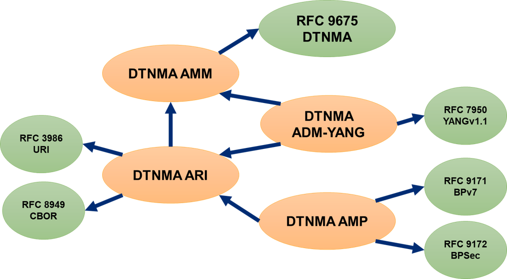

<!--
Copyright (c) 2024-2026 The Johns Hopkins University Applied Physics
Laboratory LLC.

This file is part of the Delay-Tolerant Networking Management
Architecture (DTNMA) documentation project.

Licensed under the Apache License, Version 2.0 (the "License");
you may not use this file except in compliance with the License.
You may obtain a copy of the License at
    http://www.apache.org/licenses/LICENSE-2.0
Unless required by applicable law or agreed to in writing, software
distributed under the License is distributed on an "AS IS" BASIS,
WITHOUT WARRANTIES OR CONDITIONS OF ANY KIND, either express or implied.
See the License for the specific language governing permissions and
limitations under the License.
-->
This project hosts [DTNMA 101](dtnma-101/) introductory explanations as well as descriptions of and links to external specifications and other resources.

The Delay-Tolerant Network Management Architecture (DTNMA) is defined by the IETF in informational [RFC 9675](https://www.rfc-editor.org/rfc/rfc9675.html).
A brief summary of its specification tree is shown below.

The detailed structural and behavioral model for Agents and Managers, the Application Management Model (AMM), is defined in [draft-ietf-dtn-amm](https://datatracker.ietf.org/doc/draft-ietf-dtn-amm/).
The encoding of managed data is accomplished using Application Resource Identifiers (ARI), defined in [draft-ietf-dtn-ari](https://datatracker.ietf.org/doc/draft-ietf-dtn-ari/).
Transport of ARI values between Agent and Manager is performed by the Asynchronous Management Protocol (AMP) defined in [draft-ietf-dtn-amp](https://datatracker.ietf.org/doc/draft-ietf-dtn-amp/).
The definition of individual Application Data Models (ADMs) and their encoding to module files is defined in [draft-ietf-dtn-adm-yang](https://datatracker.ietf.org/doc/draft-ietf-dtn-adm-yang/).
